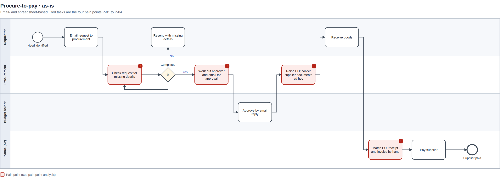
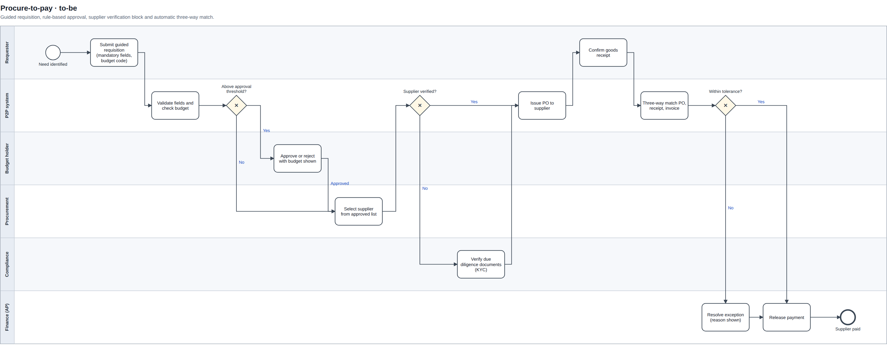

# Procure-to-Pay Requirements Pack

**Business analysis portfolio project · Chiamaka Ikpo**

A complete requirements pack for moving a bank's procure-to-pay (P2P) process from email and spreadsheets to a controlled, system-led workflow: business requirements document, BPMN process maps, user story backlog, RACI, traceability matrix and UAT test cases.

[Case study write-up](https://chiamakaikpo.github.io/case-procurement.html)

> **Basis:** my hands-on experience as a Procurement Officer at a commercial bank. The organisation is anonymised, the process is generalised, and approval values are illustrative. No confidential information is included.

## The problem

Banks are closely regulated, so every purchase must be traceable. The current process relies on email chains and manual checks:

| ID | Pain point |
|---|---|
| P-01 | Requisitions arrive incomplete, causing back-and-forth before a PO can be raised |
| P-02 | Approval routing depends on people knowing who to email |
| P-03 | Supplier onboarding documents are collected inconsistently |
| P-04 | Three-way match (PO, goods receipt, invoice) is checked by hand, delaying payment |

## Current process (as-is)

Red tasks are the pain points. Open [`process/as_is.bpmn`](process/as_is.bpmn) in [bpmn.io](https://demo.bpmn.io) or Camunda Modeler to edit it.



## Future process (to-be)

Validation, routing, supplier checks and matching move into the system, so people only handle decisions and exceptions. [`process/to_be.bpmn`](process/to_be.bpmn)



## Deliverables

| Deliverable | What it contains | File |
|---|---|---|
| Business Requirements Document | Scope, problem statement, objectives and KPIs, stakeholders, RACI, as-is and to-be, 17 requirements (MoSCoW), business rules, assumptions and risks, open questions, sign-off | [`docs/BRD_Procure_to_Pay.pdf`](docs/BRD_Procure_to_Pay.pdf) · [.docx](docs/BRD_Procure_to_Pay.docx) |
| BPMN 2.0 process maps | Swimlane maps that open in any BPMN tool | [`process/`](process/) |
| User story backlog | 12 stories in 6 epics with Given/When/Then acceptance criteria and estimates, ready to import into Jira | [`backlog/user_stories.md`](backlog/user_stories.md) · [.csv](backlog/user_stories.csv) |
| Requirements workbook | Stakeholder register, RACI with a one-Accountable check, traceability matrix (pain point → requirement → story → test), 19 UAT test cases, and a coverage summary driven by formulas | [`docs/P2P_Requirements_Workbook.xlsx`](docs/P2P_Requirements_Workbook.xlsx) |

## Traceability

Every requirement traces back to a pain point and forward to user stories and UAT tests. In the workbook, the **Summary** tab updates as testers mark tests Pass or Fail, and shows whether all *Must* requirements have passed before a go-live decision.

```
P-03  Supplier documents collected inconsistently
 └─ BR-02  No PO may be issued to a supplier whose due diligence is not verified        (Must)
     ├─ FR-06  Supplier status held on the record; PO blocked unless Verified        (Must)
     │   └─ US-03  Compliance officer: block POs to unverified suppliers
     │       └─ TC-05  Given status Pending, raising a PO is blocked and missing documents shown
     └─ FR-07  Standard onboarding checklist; alert 30 days before documents expire  (Should)
         └─ US-05 → TC-08, TC-09
```

## RACI

| Activity | Requester | Procurement | Finance | Compliance |
|---|---|---|---|---|
| Raise requisition | R/A | I | I | – |
| Source & select supplier | C | R/A | I | C |
| Supplier due diligence | – | R | – | A |
| Approve PO | I | R | A | – |
| Confirm goods receipt | R/A | I | I | – |
| Match & pay invoice | – | C | R/A | – |

## What I learned

Requesters and compliance want opposite things: less friction and more control. The best requirements serve both. A guided requisition form, for example, makes the compliant path the easiest one.

## Rebuild the artefacts

Everything is generated from one source, [`scripts/content.json`](scripts/content.json), so the BRD, backlog and workbook always agree.

```bash
cd scripts
python build_process_maps.py            # process/*.bpmn and *.svg
python build_backlog_and_workbook.py    # backlog/ and docs/P2P_Requirements_Workbook.xlsx
node build_brd.js                       # docs/BRD_Procure_to_Pay.docx  (npm install docx)
```

## Tools

BPMN 2.0 · MoSCoW · user stories and Gherkin-style acceptance criteria · RACI · Excel · Word · Python · JavaScript
